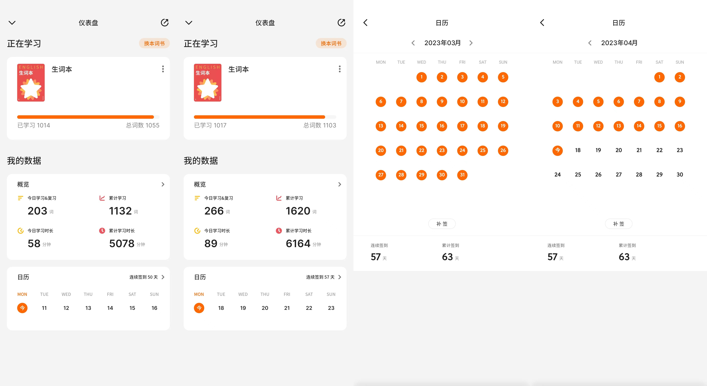

每个人都应该有自己的提升词汇量的习惯，很可惜我在今年才醒悟英语的重要性，深刻认识自己之前错误的学习和记忆方法，本篇文章和大家分享下，我是如何找到适合自己的单词记忆方式。

<!--more-->## 维护自己的生词本
相信每个人，特别是 IT 从业者，都一定有查询生词的工具与手段，包括但不限于：

- 网页插件查词（沙拉查词）

- 本地词典（欧陆词典）

- 快捷键取词查词（Bob）

- youtube & netflix 字幕翻译插件 (language reactor)

- 闪卡（Anki）

- ……

包括以上工具还有很多，这么多年我都使用过，但是英语一直无法提升，我总结了我忽视的最重要的一点原因：完全没有复习查过的重要的单词，每次遇到生词，看下解释，结束。下次再看到，瞬间看下解释，结束，只有出现 15+ 次超级频繁的单词会恰好适应记忆曲线所慢慢记忆，其余的单词早就抛在脑后了，所以复习生词本是重中之重的一个手段，但是每个软件的生词本太分散了，所以我今年开始只使用 **eudic** (欧路词典)，它可以做到全平台云同步，然后每周导出我需要 **review** 的生词在 「不背单词」上进行记忆 & 学习。

我认为：记忆自己维护的生词本对比记忆： ***coca 、雅思、六级*** 要能坚持的下去，因为记忆单词初期最难的问题是：无法坚持！为什么我无法坚持学习呢？我分析有以下原因：

- 有的单词太难记，感觉记了也没用，开始怀疑词书

- 枯燥，记了这么多能用几个？

- 不够重视，感觉今天不记也 OK？

然后我从2月开始就维护了自己的生词本，到今天已经维护了 1000 + 生词，自己维护的生词都是在书中或者各种网站经常看到的，记忆起来比较主动，首先知道是有用的，也都是眼熟的，也有了记忆的动力，并且这些单词都是实打实的生词。

## 如何获取生词
我的生词获取方式是一下三点：

- hack news | twitter | reddit | github 等日常网站

- 英文原本小说

- 英语字母看英文动画片（开心汉堡店、怪诞小镇、马男波杰克…）

我会将看到至少 2 次的单词，或者总是眼熟但那是不明其意的单词加入到我的生词本中。当然期间也同时在进行着复习，如果幸运的你看到了之前记忆过得单词，大脑会分泌多巴胺，那种瞬间惊喜就是最好的回报。

## 自己的生词本的弊端
但是记忆了 50 天后复盘发现了一些问题：我每天维护生词的速度远远赶不上记忆的速度了，以我目前的速度，每天可以无痛背50 左右个单词，但是每天只有 20 个生词可背，导致每天复习完就没事做。

还有一点：英文小说中有大量的形容词，假如我加入了这些单词到我的生词本，其实记忆的效果不如直接记忆他的”原型“，我举几个例子：

- incorporating (incorporate)

- flattering (flatter)

- supposedly (supposed)

其实如果正确的掌握了原型，很多 形容词 名词 之前的变形就不用记了，所以逐渐的我已经明白词书的重要性了，也明白词书的「存在即合理」的道理，于是已经切换到 「雅思词库」进行记忆了，但是生词本的维护还是没有放弃，并且还是会定期 review，通过这 50 天的磨炼我也不算是走了弯路，反而我觉得我获得了最重要的东西：坚持 & 习惯 ！通过连续不断地 50 天打卡，我已经养成了背单词的习惯。

## 记单词在记什么
后来经过复盘，前 1000 个生词我花的时间有点太多了，用了 5000 分钟，因为我一直在寻找防范，我总结的经验是这样的：

- 1：先看词性，找到原型，如有有原型，先记忆原型

- 2：看词根词缀，如果合乎我们记忆的逻辑，可以优先使用词根词缀记忆取代死记硬背，当然有的词根词缀很离谱，就可以无视了

- 3：固定搭配和短语，这个太重要了

- 4：实在难记，使用大量例句磨一磨耳朵，没别的办法了，确实有很多词根很难记

## 如何复习
想必很多记忆曲线的软件都是默认以天为单位：今天学习的，明天复习。明天答对的 N 天后复习，答错的还是第二天复习，看起来没什么问题，但是现实是：这是软件的骗局，正常应该是以小时为单位，甚至是当天复习两遍，但是如果软件默认就这样交互，没人愿意用了，因为太折磨了，所以第二天我们会忘记巨量的单词，这个时候我的方法是：当天复习两遍，不需要复习很久。

比如每天复习 200 单词，第一次软件默认的逻辑我们可能需要复习 30 分钟左右，但是过 几个小时我们按列表顺一遍就可以了，大概只需要 10分钟，过几个小时再顺一遍，可能只需要 8 分钟，但是这对第二天以及长期记忆是相当有好处的（亲身体会）

## 什么时候张嘴
我看过很多大佬的复盘，总结的经验是：如果你没有语言环境（人在国外、身边母语者）那就轻易不要张嘴，知道自己的词汇量达到 7000 - 8000 并且大量 input 美剧，英语之后，可以张嘴了。在没有达到条件的时候轻易先不张嘴进行 output，否则很容易中式英语那个味道就来了，而且后期不好改正，先进行输入，没有输入就没有输出。

## 不记单词只看书法
有很多大佬推荐：不需要记忆单词，只要看书就好了，找到适合自己输入的 N+1 可理解输入的书，然后进行大量阅读就好了。

我开始非常赞同这个方式，我也在1月进行了亲身实践，我的结论是：不适合我自己

- 找书困难（适合自己蓝思值太简单的书都很幼稚的）

- 看书标记的单词不复习（看了又忘，有的单词读完一本也没记住，只是特别眼熟）

- 没有成就感（读完一本书我究竟掌握了多少单词）

这一些导致我无法坚持，我不批判这种学习方式，我只想说，这种方式比较适合从小培养，从小阅读，如果你像我一样：已经大学毕业英语水平还是一般，这种方法就不适合初期的我们，我们现在就是要提升单词量，提升到一个能说得过去的程度再说，比如 8000 - 10000。

然后再进行阅读，这样的阅读、能起到复习的作用，还能学习固定搭配，提升词汇量，书籍的选择性也相当多，比如我目前可以阅读 850L 左右蓝思值的书，没有太大的压力，每页查询单词 2 个左右，相反，如果不提升词汇量，初期很难熬过去，会对阅读进行抵触。

一下是一些学习记录，我的规划是：2023 词汇至少突破 10000，然后进行泛读 & 输出。

