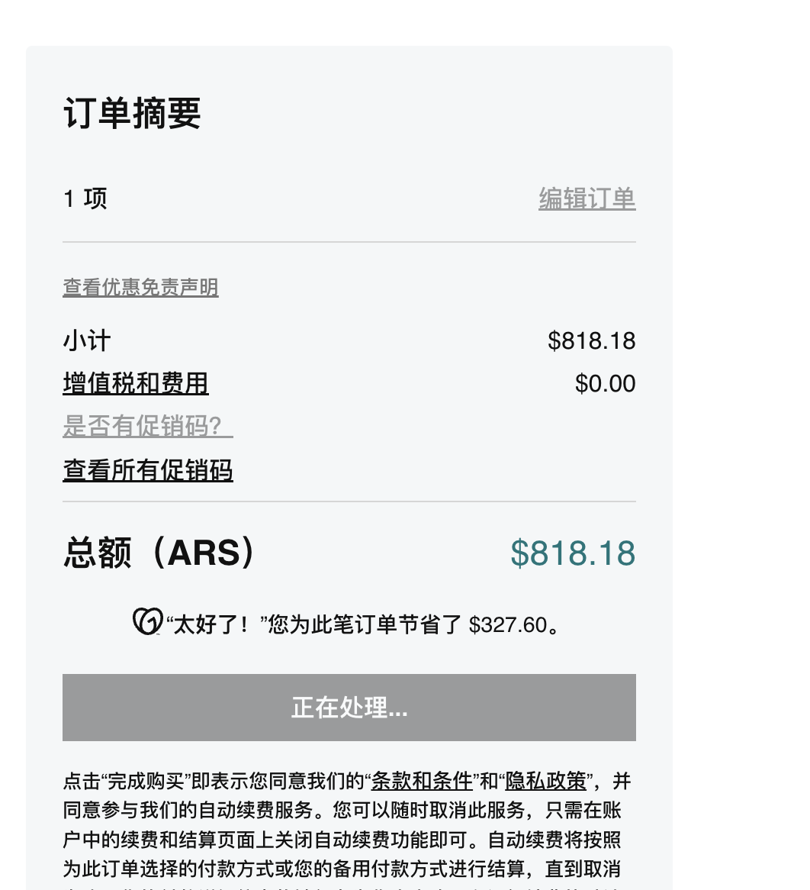
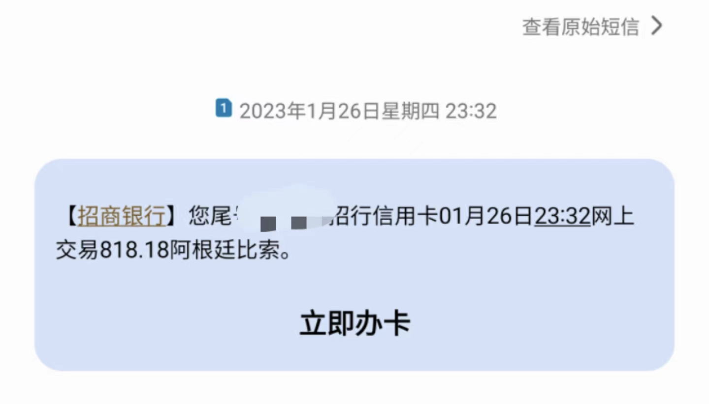

过年好，标题是我开玩笑的，阿根廷为了刺激消费出了一些政策，应该不算是漏洞，我借此续费了一些域名，大概 40% OFF 左右，前提是有 VISA 全币种卡，教程：

### Godaddy 主站切换地区币种
<!--more-->

西主站下拉到最下面，建议为新加坡区，支付方式为 ARS（阿根廷比索）

### 结算
选需要续费的域名，进入购物车结算即可，具体金额以信用卡 POST 金额为准。

以目前汇率，818 比索不到30块人民币的样子，很多人撸了酒店已经住进去了，还有定机票、报旅行团的，甚至有交学费的，有一些最终没有 POST，有一些已经成功。

### 还能买什么？


直接看坛里大佬们的操作好了👆🏻

